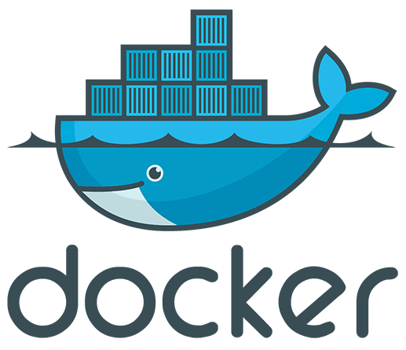
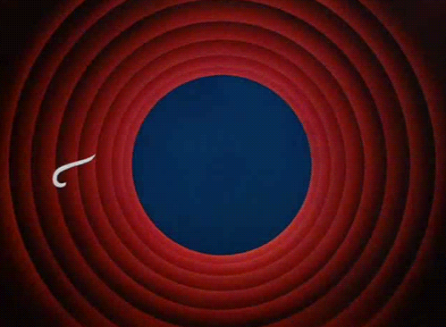

class: center, middle, inverse
## What's up ?

---
## X versions since last meetup

Bla

---
## Some nice stuff

* Update Strategy :
 * --update-delay duration          Delay between updates
 * --update-failure-action string   Action on update failure (pause|continue) (default "pause")
 * --update-parallelism uint        Maximum number of tasks updated simultaneously (0 to update all at once) (default 1)

---
class: center, middle, inverse

## 

